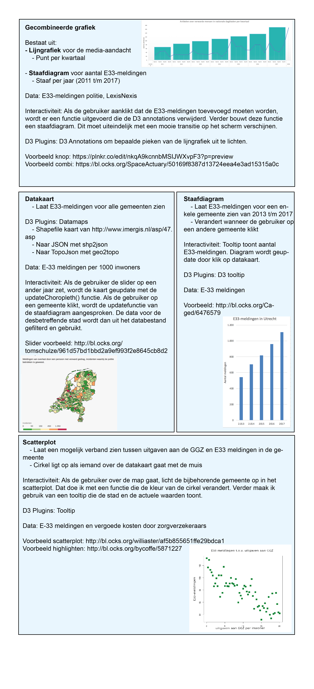

# Eindproject - Jochem Bruins
## DESIGN

## Databronnen

### Media-aandacht
#### Lijngrafiek
Lexis Nexis is een online databank met onder meer een archief met daarin alle artikelen uit de Nederlandse dagbladen. Om de media-aandacht voor verwarde personen te meten heb ik hier gebruik van gemaakt. Met de geavanceerde zoekmachine (te vinden op http://academic.lexisnexis.nl) heb ik alle artikelen over dit onderwerp opgevraagd sinds 1 januari 2011 (sidns deze dag houdt de politie ook E33 meldingen bij). Dit heb ik gedaan met de volgende zoekopdracht: 
'''
verwarde personen OR verward persoon OR verwarde persoon OR verwarde man OR verwarde vrouw
'''

Deze zoekopdracht gaf ruim 1700 artikelen. Lexis Nexis biedt vervolgens de mogelijkheid om een CSV te downloaden met daarin o.a. de titel van het stuk, de krant, de datum en de auteur. Dit document heb ik vervolgens met Excel opgeschoond en getransformeerd. Zo heb ik alle duplicaten (sommige artikelen stonder er meerdere keren in) eruit gehaald en heb ik de datum in een vast formaat gezet. Het eindresultaat: een CSV met daarin 1518 artikelen met daarbij o.a. de datum en de titel. 

In Javascript zal ik bepalen hoeveel artikelen er per kwartaal zijn gepubliceerd. Hiervoor zal ik de datumvariabele moeten gebruiken om het kwartaal te bepalen. Vervolgens moet ik bepalen hoeveel artikelen er in elk kwartaal zijn geschreven. Het kwartaal met de bijbehorende hoeveelheid artikelen kan ik vervolgens als JSON exporteren.

### E33-meldingen
#### gecombineerde grafiek(Staafdiagram icm eerder genoemde lijngrafiek)
Afgelopen voorjaar heeft de politie een excel-bestand openbaar gemaakt met daarin alle gemeenten en de hoeveelheid E33-meldingen per jaar sinds 2013 (zie https://www.politie.nl/binaries/content/assets/politie/nieuws/2018/personen-verward-gedrag-2017.xlsx). Voor de staafdiagram heb ik de totalen voor elk jaar uitgerekend (simpelweg in excel). Ook de totalen voor 2011 en 2012 zijn bekend, maar niet aanwezig in het bestand. Deze moet ik handmatig toevoegen. Voor de staafdiagram maak ik een aparte CSV met daarin alle jaren en de bijbehorende totalen. 

#### KAART
De gegevens uit het bestand van de politie bestaan uit absolute waarden: de hoeveelheid E33 meldingen per jaar per gemeente. Voor alle gemeentes heb ik inwonersaantallen op 1 januari 2013 t/m 2017 uit de database van het CBS gehaald. Deze heb ik in hetzelfde excelbestand gezet en vervolgens alle E33 meldingen door het aantal inwoners gedeeld en vermenigvuldigd met 1000. Als de inwoneraantallen niet voor alle jaren aanwezig waren (bijvoorbeeld omdat de gemeente later dan 2013 is ontstaan), heb ik de gegevens van het laatst beschikbare jaar gekopieerd. 

Voor de kaart zal de data nog gekoppeld moeten worden aan een datamap met daarop alle Nederlandse gemeenten (inmiddels gevonden. 

#### Staafdiagram
Voor de staafdiagram hoeft de data niet verder getransformeerd te worden aangezien er voor elke gemeente van de jaren 2013 t/m 2017 de aantallen E33-meldingen worden gegeven.

### Vergoede kosten door zorgverzekeraars (waaronder GGZ-kosten)
#### Scaterplot
Victis houdt bij hoe veel de zorgverzekeraars uitkeren aan de verschillende takken van de zorg. Zij delen de jaarlijkse data (ik gebruik het laatst beschikbare jaar: 2016) in een CSV waarin de uitgaven staan opgedeeld per gemeente, geslacht en leeftijdsgroep (per vijf jaar). Voordat ik de data kon gebruiken, moest ik alle leeftijdsgroepen en geslachten per gemeente samenvoegen en de data die niet over de GGZ ging verwijderen. Vervolgens heb ik een kolom toegevoegd met daarin de totale kosten voor de GGZ. In een tweede kolom heb ik dit bedrag gedeeld door het aantal verzekeringsjaren (komt bijna overeen met het aantal inwoners van elke gemeente). In deze kolom zie je dus de kosten van de GGZ per verzekerde inwoner. In combinatie met de data over de E33-meldingen per duizend inwoners per gemeente kan ik een scatterplot gaan maken met daarin een punt voor elke gemeente. 

### Overzichtsdiagram

