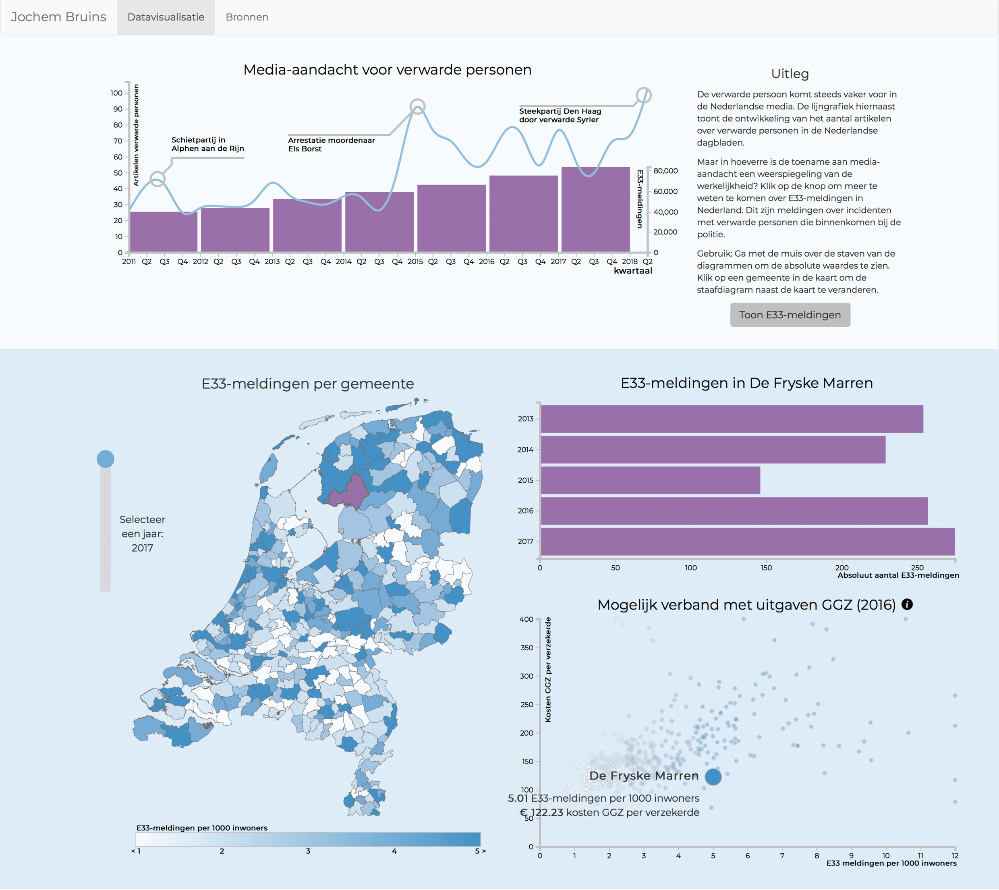

# Verwarde personen - Jochem Bruins
## Eindproject MPROG

## Link
https://jochembruins.github.io/finalproject/scripts/index.html

## Link demo
https://vimeo.com/277547845

## Doel
Deze datavisualitatie toont de toename van media-aandacht voor incidenten met verwarde personen en onderzoekt of dit een correcte afspiegeling is van de werkelijkheid. Verder laat het zien of deze toename mogelijk samenhangt met de uitgaven aan de GGZ.

## Screenschot

## Copyright
De algemene voorwaarden voor gebruik, reproductie en distributie van de code zijn te vinden in LICENSE.MD. Verder is er gebruik gemaakt van verschillende 'libraries' naar wie specifiek verwezen moet worden:

* D3 - Copyright 2010-2017 Mike Bostock
* D3 tip - Copyright (c) 2013 Justin Palmer
* D3 annotations - Copyright (c) 2017, Susie Lu

