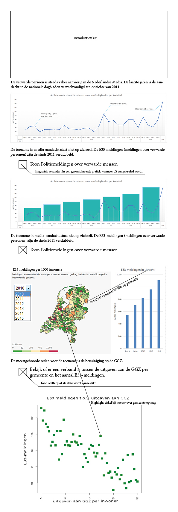

# Projectvoorstel - Jochem Bruins
## Eindproject MPROG

## Probleemstelling 
'Verwarde man wandelt met mes door centrum van Kampen', en 'Verwarde persoon gooit meubilair op straat'. Bijna dagelijks halen soortgelijke koppen de nationale kranten. Als we de krantenkoppen moeten geloven, loopt Nederland over van verwarde personen. De meestgenoemde veroorzaker van dit probleem: bezuinigingen op de GGZ. 

## Oplossing
Mijn datavisualitatie onderzoekt of er daadwerkelijk een toename is van verwarde personen en laat zien of deze inderdaad komt door de bezuinigingen in de GGZ. 

### Sketch

### Functies (MVP) 
* Gebruiker kan de lijngrafiek verandereren in een gecombineerde grafiek door de checkbox aan te klikken. Vervolgens kan de gebruiker de hoeveelheid E33-meldingen per jaar zien.

* Door dezelfde checkbox aan te klikken opent zich ook een kaart. Als de gebruiker op een gemeente klikt, verandert de staafdiagram naar de zojuist aangeklikte stad. 

* De data van de kaart kan veranderd worden met een dropdown met daarin alle jaartallen. Dit kan mogelijk ook een slider worden. 

* Wanneer de gebruiker een nieuwe checkbox aanklikt, opent hij of zij een scatterplot.

* Als je in de kaart over een gemeente gaat met je muis, ligt de bijbehorende cirkel in het scatterplot op. 

#### Extra functies (als er nog tijd is)
* Een zoekfunctie om op de kaart een bepaalde gemeente te vinden.

## Vereisten

### Databronnen
* Media-aandacht voor verwarde personen. Opschonen nodig (veel duplicaten). Verkregen m.b.v. http://academic.lexisnexis.nl.

* E33-meldingen bij de politie per gemeente per jaar. Data moet gekoppeld worden aan locaties op de kaart. https://www.politie.nl/binaries/content/assets/politie/nieuws/2018/personen-verward-gedrag-2017.xlsx

* Vergoede kosten door zorgverzekeraars (waaronder GGZ-kosten) per gemeente. Data is nu nog opgedeeld per leeftijdscategorie en geslacht. Dit moet samengevoegd worden. https://www.vektis.nl/streams/open-data

### Externe componenten
* D3-annotations voor de uitgelichte nieuwsmomenten bij de lijngrafiek. http://d3-annotation.susielu.com/#setup

### Vergelijkbare visualisatie
Voor mijn 'probleem' zijn er weinig gerelateerde visualisaties. Meerdere kranten maakten een kaartje van de E33-meldingen nadat de politie deze cijfers openbaar maakte.

Kaart in artikel van het AD (zie: https://www.ad.nl/binnenland/politie-luidt-noodklok-recordaantal-incidenten-verwarde-personen-kijk-hier-waar~a9a3a9ac/)

Dit kaartje laat het aantal E33-meldingen per gemeente zien. Deze data is niet heel interessant aangezien het niet is gecorrigeerd voor het aantal personen in de gemeente. Ik wil het aantal E33-meldingen per duizend inwoners weergeven. Zij zijn in staat geweest de data uit de dataset van de politie te koppelen aan een kaart. Dit wordt voor mij een uitdaging. De mogelijkheid om andere jaren te bekijken wil ik ook doen door middel van een drop-down of slider. 

### Moeilijkheden
* De data van de verzekeraars transformeren en vervolgens koppelen aan de gemeenten in de dataset van de politie. Hierbij moet ik hopen dat de namen niet op verschillende manieren geschreven zijn en dat de gemeentelijke indeling niet verscheelt. 

* Het combineren van een lijngrafiek en staafdiagram in een plot. Gelukkig zijn er voorbeelden op het internet te vinden. 

